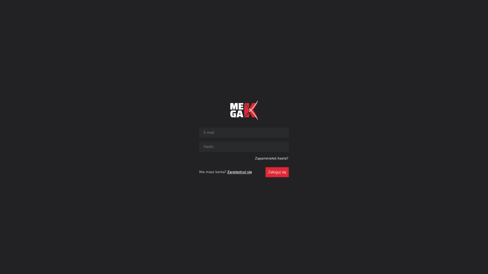
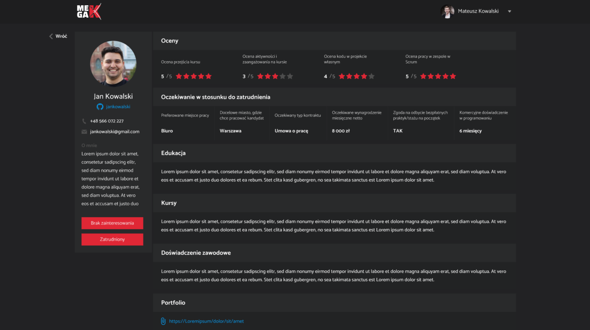
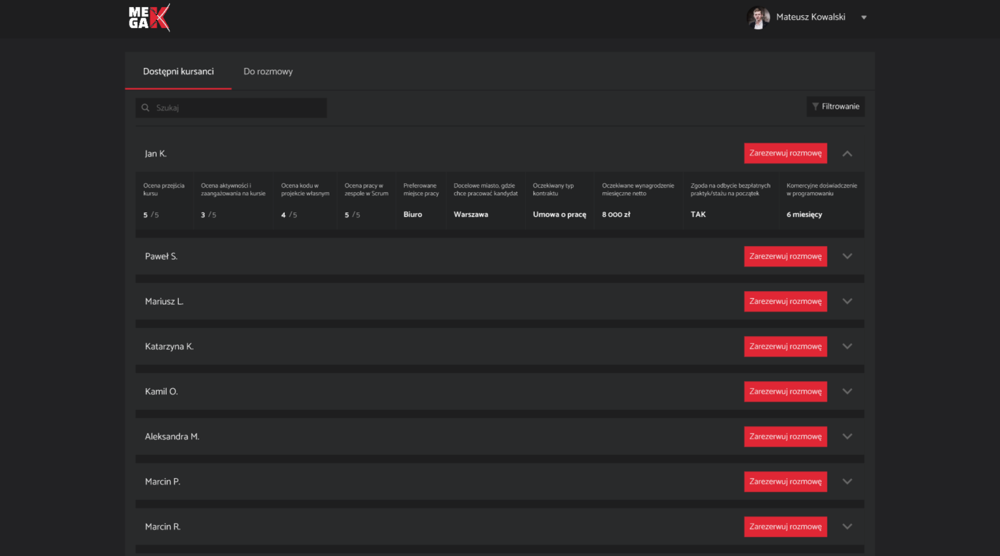
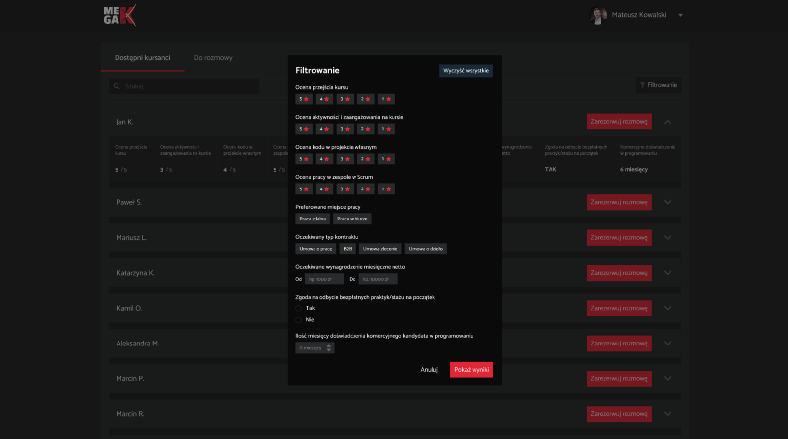
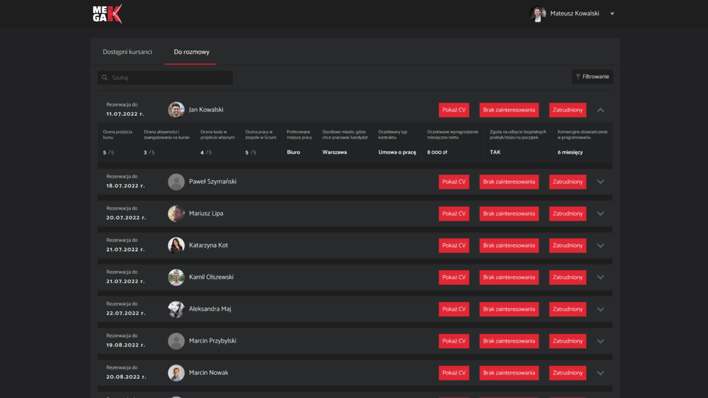

# :construction_worker: HeadHunter MegaK v0.1.0 frontend
Application as a recruitment platform. It connects the graduates of programming school and potential employers. The purpose of the app is to help students find their first job as a developers.

## :bear: Resources

**Github frontend:** https://github.com/Jutrzenka/HeadHunterG11-FR \
**Github backend:** https://github.com/Jutrzenka/HeadHunterG11-BE


## :trophy: Project goals

  1. Create a web application supporting recruitment processes.
  2. Allow students to showcase their skills in a structured way.
  3. Enable HR departments and headhunters to easily search, filter and contact candidates.
  5. Provide administrators with control over access and user management.

## :sparkles: Main features
  
  1. Registration via invitation link – secure access for students (Kursant) and HR.
  2. Student profile – personal data, GitHub, portfolio, work preferences, expected salary, education, work experience, courses.
  3. HR panel – list of available students with search and sorting options.
  4. Conversation list – HR can mark selected students for interviews.
  5. CV view – detailed candidate profile with dynamic data.
  6. Statuses – Available / In conversation / Hired (automatic status updates after 10 days).
  7. PWA support – installable from Chrome & Safari mobile/desktop.

## :framed_picture: Screenshots

**Login view**  
 

**Student profile**  
 

**Student list (for students)** – adding and editing profile  
 


**Filtering students (for employers)**  


**Student list (for employers)**  


## :cow: Tech Stack


## :guardsman: Authors:
**Group members:**
1. [Jutrzenka](https://github.com/Jutrzenka) **Jutrzenka#2251** kacperczaja1999@gmail.com
2. [iwanczakrafal](https://github.com/iwanczakrafal)
3. [madridista5](https://github.com/madridista5)
4. [Marcel998](https://github.com/Marcel998) **Marcel998#5607**
5. [marooonio](https://github.com/marooonio)
6. [NorGoz](https://github.com/NorGoz)
7. [OllaWilk](https://github.com/OllaWilk)
8. [RafalKuchta](https://github.com/RafalKuchta)

**Additional roles in the team:**
- SM: [Jutrzenka](https://github.com/Jutrzenka)
- Author of demo films: [Marcel998](https://github.com/Marcel998)

## :camel: Project structure
```
HeadHunterG11-FR
├── build
├── public
│   ├── img
│   ├── favicon.png
│   ├── index.html
│   ├── manifest.json
│   └── robots.txt
├── src
│   ├── components
│   ├── redux
│   ├── styles
│   ├── utils
│   ├── views
│   ├── App.tsx
│   └── config.env.ts
├── .env
├── .gitignore
├── .npmrc
├── package.json
├── package-lock.json
├── README.md
└── tsconfig.json
```
## :dragon_face: Installation project

**Clone the project:**
```
git clone https://github.com/Jutrzenka/HeadHunterG11-FR.git
```
**Go to the project directory:**
```
cd HeadHunterG11-FR
```
**Install dependencies:**
```
npm install
```
**Start the server:**
```
npm start
```
